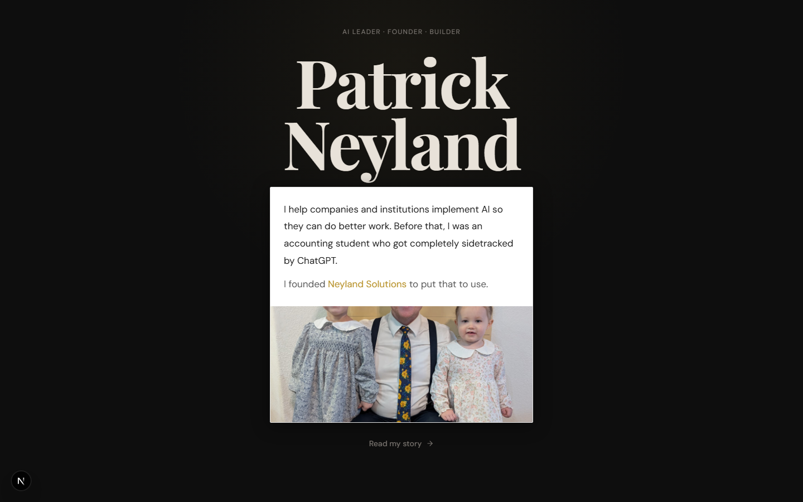
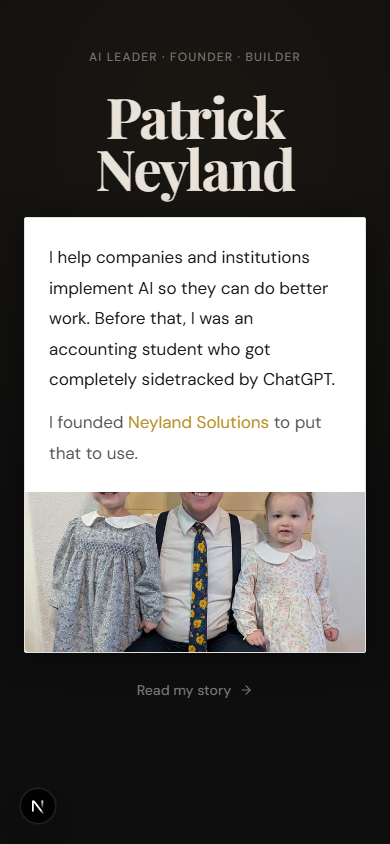
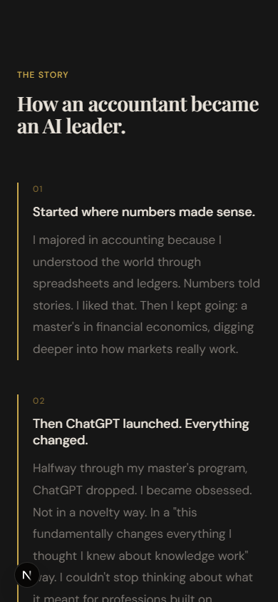

# Patrick Neyland, Personal Site

The personal site of Patrick Neyland: the AI and accounting guy. Hands-on work in AI and operations, built on a background in accounting and financial economics. Founder of [Neyland Solutions](https://neylandsolutions.com), where I help companies and institutions actually put AI to work.

> ▶ Live site: `<ADD DEPLOYED URL>`



## About this site

This is a narrative site, not a resume dump. It walks through how an accounting academic ended up building applied AI for a living, and why I decided to help institutions that cannot figure it out on their own.

The arc: a start in accounting and financial economics, then ChatGPT lands halfway through a master's and pulls me in. A PhD meant to study AI's effect on the accounting profession hits a data wall (the technology is too new to measure). Then a moment at the Arizona Department of Revenue, where the answer to "how are you using AI?" was "we don't have the bandwidth." That gap, institutions that want AI but cannot get there alone, is why I founded Neyland Solutions. The site itself tells the full story.

## Built with

| Layer | Tool |
|---|---|
| Framework | Next.js 15.2 (App Router) |
| UI library | React 19 |
| Styling | Tailwind CSS 3.4 |
| Animation | Framer Motion 12 |
| Icons | lucide-react |
| Language | TypeScript 5 |

## Design and writing principles

For an AI consultant, how the site reads is part of the pitch. Two things shape it.

The look follows a defined design system documented in [`design.md`](design.md): a dark editorial theme with warmth, Playfair Display paired with DM Sans, a warm gold accent that nods to the accounting roots, and blur-fade reveals that let the story unfold as you scroll instead of dumping it all at once.

The copy follows a strict style guide in [`ai-writing-detection.md`](ai-writing-detection.md): a prohibition list of the words, phrases, and structures that make writing read as AI generated. No em dashes, no "leverage," no filler. Every line is meant to sound like a person wrote it, because a person did.

<p>
  
  
</p>

## Run it locally

```bash
git clone <this-repo-url>
cd pat-personal-site
npm install
npm run dev
```

Then open http://localhost:3000.

Other scripts:

```bash
npm run build   # production build
npm run start   # serve the production build
npm run lint    # lint
```

## Status

The site is built and actively evolving. I am planning a rebuild, so expect the sections and structure to shift. The positioning, the design system, and the writing rules stay the same. (Add the deployed URL to the live-site line at the top once it is hosted.)

## Connect

Built by Patrick Neyland. The company arm is [Neyland Solutions](https://neylandsolutions.com), where I help teams implement AI and do better work.
